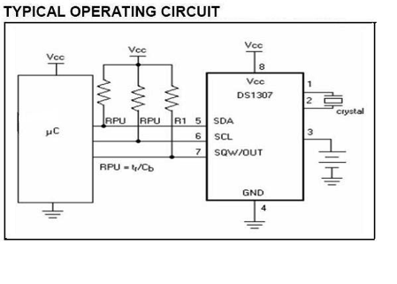

# SmartHome
This repository contains a smart home implementation using 802.15.4

##Overview

##Hardware 

There were 2 hardware boards that was developed for this project. One was an general purpose AVR development board (shown below) and the other was a board that would connect to the Zigbee device using SPI bus.

![AVR general dev board] (https://lh3.googleusercontent.com/-xXU5mJjgmrk/VcG7TZ-O89I/AAAAAAAAPRM/-IVA6IYXRnE/s640-Ic42/devboard_features.JPG)

### Micro controller
The micro controller that is used for this project is AVR ATmega series(ATmega32/ATmega64/ATmega324P). Atmel controller was chosen because of the integrated peripheral, the availability of open source tools(compiler, programmer)etc. The L version of the atmel controllers was used as CC2420 chips works at 3.3v and 5v.

### Zigbee /802.15.4 radio module
The Zigbee module that was used in this project is the [Easybee module](http://www.rfsolutions.co.uk/acatalog/info_EASYBEE.html) which contains the  [chipcon cc2420](http://www.ti.com/product/cc2420).

### Sensors
The key component of any smart home is the sensors and the devices that the smart home can control. In this project a seperate board for sensor board was created with the below sensors.

#### Temperature Sensor
In order to accurately measure the temperate DS1624 from maxim was used. The reason for choosing this sensor is that its an integrated temperature sensor and connects easily via the I2C bus.

#### Real time clock
The time keeping was performed by the RTC DS1307.DS1307 keeps track of date, time , year.DS1307 has a battery backup so that it doesnot lose time even in case of power failure

#### PIR sensor
PIR sensor was used to detect the presence of person and based on occupancy, the lights were controlled.
![PIR] (pictures/PIR sensor.png)

#### Light sensor
The light sensor used in this project is a simple LDR that is connected to micro controller via the ADC.
[light] (pictures/lightsensor.png)

####Appliance control 
In order to control various appliances that might be connected to the zigbee board a seperate board was designed with atmega 13 so that we can control the appliances via relays.
![appliances] (pictures/ApplianceControl.png)

#### Devices control
In order to control devices, a nokia LCD was connected to the device with zigbee node via which one can perform all the application control.Think it as a remote contorl with LCD interface.

### Programmer
The programmer that was used in the development of this project is a parallel port programmer based on one of my senior vignesh E [design](http://www.vignesh.byethost4.com/isp.html)

##Nodes
The project was started with the idea of writing a full blown zigbee stack (how naive of us then) but we ended up creating a simple tree topology with the following 3 nodes.These names are based **loosely** on the functionality of zigbee stack.

### Coordinator
The cordinator is the top of the tree, and all traffic must flow through the co ordinator to reach the end device

### Router
These nodes are middle level nodes that are like co ordinator except that they allow attachment of end devices.These nodes are powered by power supply and provide additional functionality like appliance control.

### Mobile node
The mobile nodes are battery powered and can be a sensors or a LCD interface node that can be used to control the appliances.

##Software

The software functionality in state diagram 

![state diagram] (pictures/state_diagram.png)

The software was written in atmel studio with WinAVR package with [Procyon avrlib](http://www.procyonengineering.com/embedded/avr/avrlib/). The inital versions of the software was based on the project of our senior Vignesh E [TCE Zignet](http://www.vignesh.byethost4.com/tce_zignet.html)

So we enhanced the project further to add more sensor and also write a simple tree like topology. Currently the project is **abandoned**. However one can look at the code for interfacing differnet sensors and also its something i learnt a lot in working in this project.

##Photos

### Control device with nokia LCD

### Remote sensor

### All Devices

##Developers
The entire system was developed as part of our final year engineer project (2007-2008) by the following people in the alphabetical order
  1.Alagappan 
  2.Balaji srinivasan
  3.Jerome
  4.Pradheep Shrinivasan(me)
  5.Vasantha kumar
  6.Vivek swaminathan
